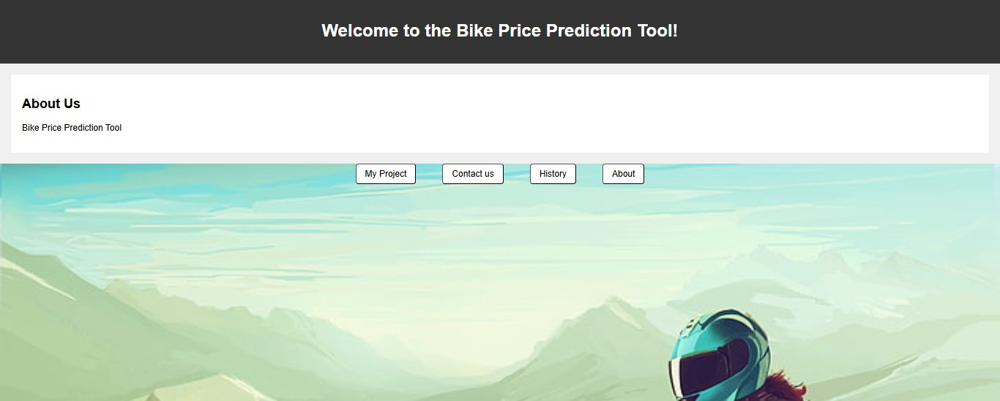
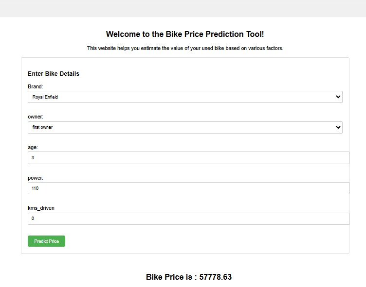
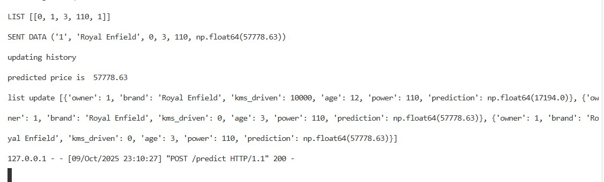

# 🚲 Bike Price Prediction System

A machine learning web application that predicts used bike prices using **Linear Regression** and **Random Forest** models with Flask deployment.

---

## 📋 Table of Contents

- [Overview](#overview)
- [Features](#features)
- [Tech Stack](#tech-stack)
- [Project Structure](#project-structure)
- [Installation](#installation)
- [Usage](#usage)
- [Model Performance](#model-performance)
- [Dataset](#dataset)
- [How It Works](#how-it-works)
- [Screenshots](#screenshots)

---

## 🎯 Overview

This project predicts the selling price of used bikes based on various features like brand, age, power, kilometers driven, and owner type. Two machine learning models are implemented and compared:

- **Linear Regression** (75% accuracy)
- **Random Forest** (90%+ accuracy)

The best-performing model is deployed using Flask web framework with an interactive user interface.

---

## ✨ Features

- 🔍 **Dual Model Comparison**: Linear Regression vs Random Forest
- 📊 **High Accuracy**: Random Forest model achieves 90%+ accuracy
- 🌐 **Web Interface**: User-friendly Flask web application
- 📝 **Prediction History**: Track previous predictions
- 🎨 **Multiple Pages**: Home, About, Contact, Project, History
- 📱 **Responsive Design**: Works on desktop and mobile
- 💾 **Model Persistence**: Saved models using joblib

---

## 🛠️ Tech Stack

**Machine Learning:**

- Python 3.x
- Scikit-learn (Model Training)
- Pandas (Data Preprocessing)
- NumPy (Numerical Operations)
- Seaborn (Data Visualization)

**Web Development:**

- Flask (Backend Framework)
- HTML/CSS (Frontend)
- Jinja2 (Template Engine)

**Tools:**

- Jupyter Notebook (Model Development)
- Joblib (Model Serialization)

---

## 📁 Project Structure

```
bike_price_pred/
│
├── Data/                      # Dataset files
│   └── bike_data.csv
│
├── templates/                 # HTML templates
│   ├── index.html            # Home page
│   ├── about.html            # About page
│   ├── contact.html          # Contact page
│   ├── project.html          # Prediction page
│   └── history.html          # History page
│
├── model.lb                   # Linear Regression model (75% accuracy)
├── rfmodel.lb                 # Random Forest model (90%+ accuracy)
├── app.py                     # Flask app (Linear Regression)
├── app2.py                    # Flask app (Random Forest)
├── bike_price_prediction.ipynb # Jupyter notebook
├── requirements.txt           # Dependencies
└── README.md                  # Project documentation
```

---

## 🚀 Installation

### Prerequisites

- Python 3.7 or higher
- pip (Python package manager)

### Steps

1. **Clone the repository**

```bash
git clone https://github.com/yourusername/bike-price-prediction.git
cd bike-price-prediction
```

2. **Create virtual environment** (Optional but recommended)

```bash
python -m venv venv
source venv/bin/activate  # On Windows: venv\Scripts\activate
```

3. **Install dependencies**

```bash
pip install -r requirements.txt
```

4. **Run the application**

For Linear Regression model (75% accuracy):

```bash
python app.py
```

For Random Forest model (90%+ accuracy):

```bash
python app2.py
```

5. **Open browser**

```
http://127.0.0.1:5000/
```

---

## 💻 Usage

1. Navigate to the **Project** page
2. Fill in the bike details:
   - **Brand Name**: Select from 23 bike brands
   - **Owner Type**: 1st, 2nd, 3rd owner
   - **Age**: Age of the bike in years
   - **Power**: Engine power in CC
   - **Kilometers Driven**: Total KMs driven
3. Click **Predict Price**
4. View predicted price instantly
5. Check **History** page for previous predictions (Random Forest model only)

---

## 📊 Model Performance

### Linear Regression (`app.py`)

- **Accuracy**: 75%
- **File**: `model.lb`
- **Use Case**: Baseline model

### Random Forest (`app2.py`) ⭐

- **Accuracy**: 90%+
- **File**: `rfmodel.lb`
- **Use Case**: Production model (Recommended)
- **Additional Feature**: Prediction history tracking

### Model Comparison

| Model             | Accuracy | Speed    | Best For             |
| ----------------- | -------- | -------- | -------------------- |
| Linear Regression | 75%      | Fast     | Quick predictions    |
| Random Forest     | 90%+     | Moderate | Accurate predictions |

---

## 📦 Dataset

**Features Used:**

- `kms_driven` - Kilometers driven by the bike
- `owner` - Owner type (1st, 2nd, 3rd, etc.)
- `age` - Age of the bike in years
- `power` - Engine power in CC
- `brand` - Bike brand (23 brands supported)

**Supported Brands:**
TVS, Royal Enfield, Triumph, Yamaha, Honda, Hero, Bajaj, Suzuki, Benelli, KTM, Mahindra, Kawasaki, Ducati, Hyosung, Harley, Jawa, BMW, Indian, Rajdoot, LML, Yezdi, MV, Ideal

---

## 🔧 How It Works

### 1. Data Preprocessing

```python
# Steps performed in Jupyter Notebook:
- Read CSV data using Pandas
- Handle missing values (dropna/fillna)
- Remove duplicates
- Filter outliers
- Feature encoding (Label Encoding for brands)
- Train-test split (80-20)
```

### 2. Model Training

```python
# Linear Regression
from sklearn.linear_model import LinearRegression
model = LinearRegression()
model.fit(X_train, y_train)

# Random Forest
from sklearn.ensemble import RandomForestRegressor
rf_model = RandomForestRegressor(n_estimators=100)
rf_model.fit(X_train, y_train)
```

### 3. Model Saving

```python
import joblib
joblib.dump(model, 'model.lb')
joblib.dump(rf_model, 'rfmodel.lb')
```

### 4. Flask Deployment

```python
# Load model
model = joblib.load('rfmodel.lb')

# Predict
prediction = model.predict([[kms, owner, age, power, brand]])
```

---

## 📸 Screenshots

### Home Page



### Prediction Page



### History Page



---

## 🎓 Key Learnings

- Data preprocessing with Pandas and NumPy
- Comparing multiple ML algorithms
- Model evaluation and selection
- Flask web application development
- Model deployment and serialization
- Feature encoding techniques
- Building user-friendly interfaces

---

## 🤝 Contributing

Contributions are welcome! Please follow these steps:

1. Fork the repository
2. Create a new branch (`git checkout -b feature/improvement`)
3. Commit changes (`git commit -am 'Add new feature'`)
4. Push to branch (`git push origin feature/improvement`)
5. Create Pull Request

---

## 👨‍💻 Author

**Your Name**

- GitHub: [@yourusername](https://github.com/kashishver-ma)
- LinkedIn: [Your Profile](https://www.linkedin.com/in/kashish-verma-7756a62b6)

---

## 🙏 Acknowledgments

- Dataset source: [Kaggle/Other Source]
- Flask documentation
- Scikit-learn community

---

**⭐ If you found this project helpful, please give it a star!**
